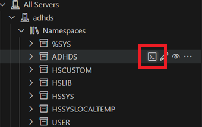

# IRIS FHIR Facade demo

## Installation

1. Run the following command: 

```bash
docker compose up
```

This will bring IRIS instance up and create an IRIS foundation but will not create a FHIR server.

2. Once the docker container is readly, connect to the IRIS via terminal and switch to the `ADHDS` namespace:


3. Invoke the following commands: 
```bash
zn "ADHDS"

Do ##class(FHIRServer.Installer).Install()
```
This will create an FHIR facade endpoint and also populate tables with some synthetic data:

```sql
select * from DemoData.Patient
```

4. Once the FHIR endpoint is ready, run some FHIR search queries, e.g.

```
http://localhost:52773/csp/healthshare/adhds/fhir/r4/Patient/1

200 OK

http://localhost:52773/csp/healthshare/adhds/fhir/r4/Patient?given=Emily&family=Miller

200 OK

http://localhost:52773/csp/healthshare/adhds/fhir/r4/Patient/000000

404 NOT FOUND


```

